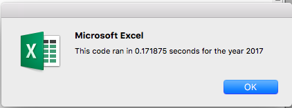

# Stock-Analysis

## Overview of Project
### Purpose
The purpose of this project is to refactor the VBA code in order to increase the efficiency and speed. The goal of the code is to analyze 12 stocks in terms of Total Volume and Return.

### Background
A client has asked if I can perform research on an array of stocks for investment purposes. The client is interested in using this code for a larger dataset, I am refactoring the code in order to increase the speed at which it runs.

## Results
### Analysis
By refactoring the data I saw increased speeds for both the 2018 and 2017 data sets.

## Summary
### Advantages of Refactoring
Some of the main advantages of refractoring your code in VBA include: greater efficiency, reduced memory use, and improved logic. By editing the code we can make it easier to work with, improving  readability and reducing complexity.

### Disadvantages of Refactoring
Refactoring code can be time consuming.

### Advantages of Refactoring in the VBA Challenge
One of the main advantages of refactoring the code is the increased speed at which it populates the data. This will be beneficial with larger data sets.

### Disadvantages of Refactoring in the VBA Challenge
The main disadvantage in refactoring is that it can be time consuming and tedious to complete the task.
